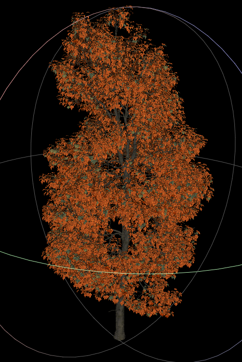
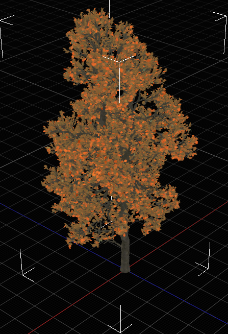
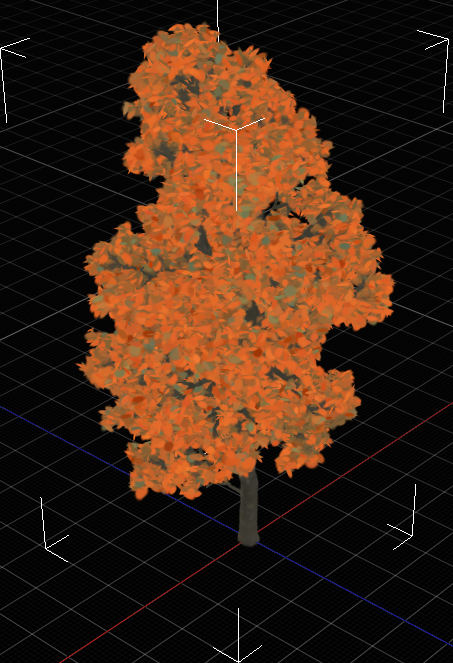
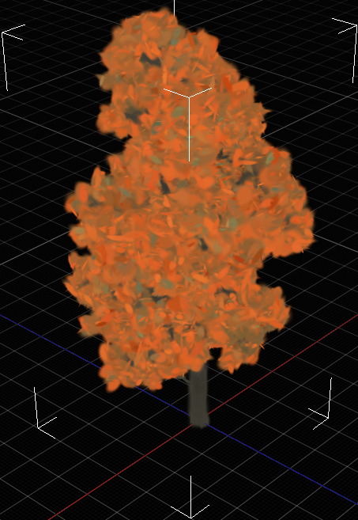
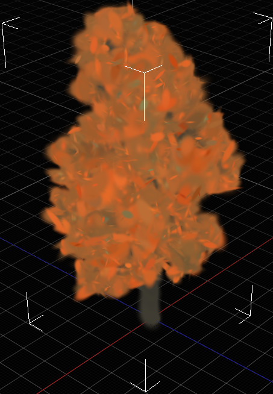
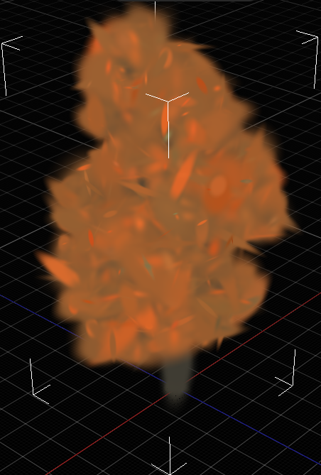

# Gaussian_LOD_from_mesh-sampling

This project is a lightweight tool to generate 3DGS LOD **(level of detail)** models from mesh model.
All you need to input is a .obj mesh,and different levels 3DGS models will be output.The level of detail is
controlled by density of sampling,which is based the structure of octree.The tool will also generate a JSON file to record the tree's structure.

## Install
```
git clone https://github.com/mustard501/Gaussian_LOD_from_mesh-sampling
cd Gaussian_LOD_from_mesh-sampling

conda create -n gs_lod python=3.10
conda activate gs_lod

pip install -r requirements.txt
```

## Usage
Create directories
```
mkdir assets/input assets/output/ assets/pcds
```

If your mesh is a white model,put .obj in ``assets/input`` and run the commands:
```
python .\src\point_sample.py
python .\src\gs_octree.py
```

If your mesh has texture,put the data folder in ``assets/input``,like:
```
assets
    └─inputs
        └─tree
            │─tree.mtl
            │─tree.obj
            │
            └─textures
                    MT_PM_V60_Acer_buergerianum_01_Leaf_01_albedo.jpg
                    MT_PM_V60_Acer_buergerianum_01_Leaf_01_glossiness.jpg
                    MT_PM_V60_Acer_buergerianum_01_Leaf_01_normal.jpg
                    MT_PM_V60_Acer_buergerianum_01_Leaf_01_opacity.jpg
```
and run the commands:
```
python .\src\sample_with_texture.py
python .\src\gs_octree.py
```
Remember to modify paths of files/folders in ``gs_octree.py,sample_with_texture.py,point_sample.py`` according to your needs.

## Example







From left to right are:**mesh**, **GS_LOD9**, **GS_LOD8**, **GS_LOD7**, **GS_LOD6**, **GS_LOD5**.
The mesh data above is downloaded from **blenderkit**, asset_base_id:32875d10-0943-423f-8692-e585f6c94ed0 asset_type:model
