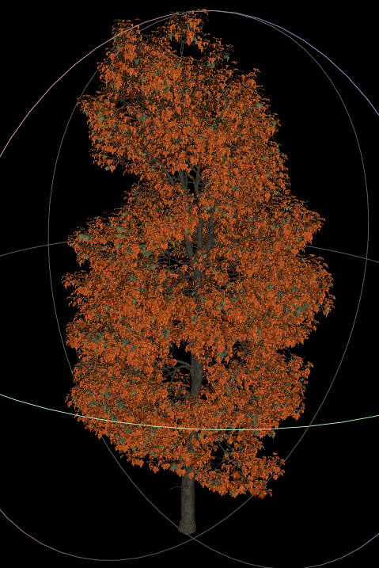
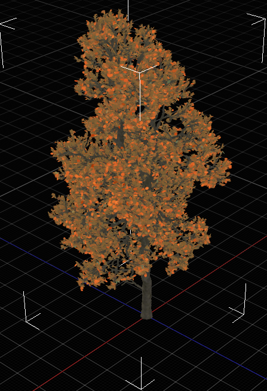
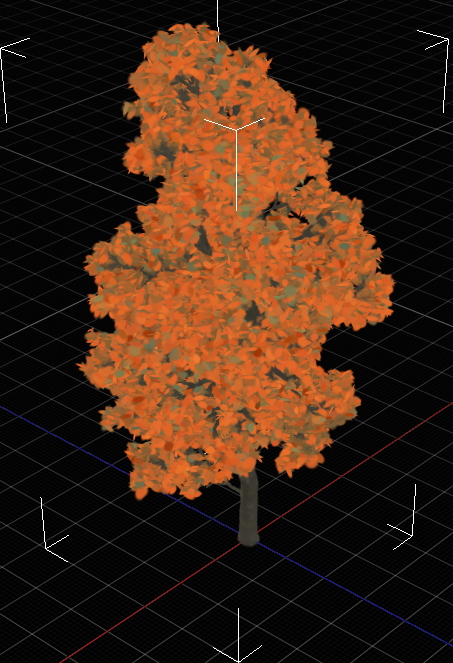
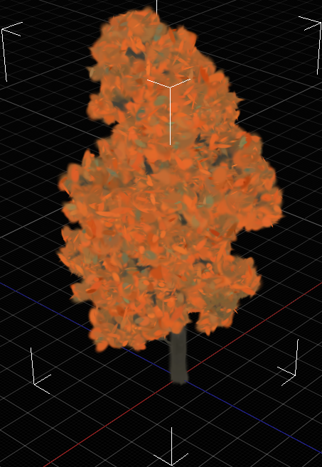
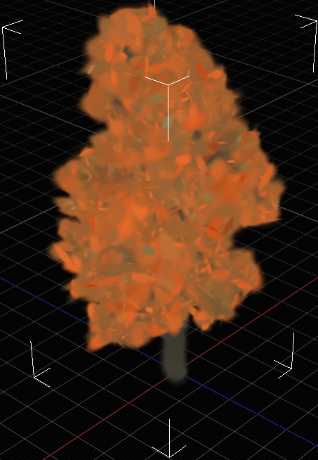
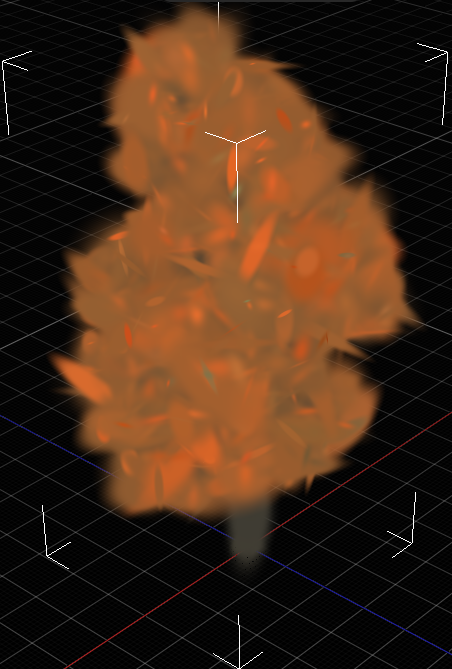

# PointSpill

This project is a lightweight tool to generate 3DGS LOD **(level of detail)** models from mesh models.
Input a mesh (`.obj`, `.glb`, `.gltf`, etc.) and get multiple 3DGS LOD outputs. LOD is controlled by octree depth; a JSON file records the tree structure.

## Install

```bash
git clone https://github.com/mustard501/PointSpill
cd PointSpill

conda create -n gs_lod python=3.10
conda activate gs_lod

pip install -r requirements.txt
```

## Directory Layout

```
PointSpill/
├── assets/             # local data (git-ignored except this folder marker)
│   ├── input/          # put mesh files here
│   ├── pcds/           # point clouds from step 1
│   └── output/         # 3DGS LOD .ply + octree JSON from step 2
└── src/
    ├── point_sample.py         # white model → point cloud
    ├── sample_with_texture.py  # baseColor textured mesh → point cloud
    └── gs_octree.py            # point cloud → 3DGS LOD
```

Create subdirectories under `assets/` as needed. Everything inside `assets/` is git-ignored.

Sampling density: **point count = face count × `--samples-per-face`** (default 2).

## Usage

All paths are passed via command-line arguments (`-i` input, `-o` output).

### 1. White model (no texture)

```bash
python src/point_sample.py -i assets/input/tree-v3.glb -o assets/pcds/tree-v3.ply
python src/gs_octree.py -i assets/pcds/tree-v3.ply -o assets/output
```

Supported formats include `.obj`, `.ply`, `.stl`, `.glb`, `.gltf`.

Optional flags:

```bash
python src/point_sample.py -i assets/input/model.obj -o assets/pcds/model.ply --samples-per-face 2 --preview
```

### 2. Textured model (baseColor only)

**GLB / GLTF** — single file with embedded baseColor textures:

```bash
python src/sample_with_texture.py -i assets/input/tree-v3.glb -o assets/pcds/tree-v3.ply
python src/gs_octree.py -i assets/pcds/tree-v3.ply -o assets/output
```

**OBJ + external textures** — folder under `assets/input/`:

```
assets/input/tree/
├── tree.mtl
├── tree.obj
└── textures/
    └── ..._albedo.jpg
```

```bash
python src/sample_with_texture.py -i assets/input/tree/tree.obj -o assets/pcds/tree.ply
python src/gs_octree.py -i assets/pcds/tree.ply -o assets/output
```

Only **baseColor RGB** is sampled; glossiness, normal, opacity and alpha channels are ignored.

### 3. Octree options

```bash
python src/gs_octree.py \
  -i assets/pcds/tree-v3.ply \
  -o assets/output \
  --max-depth 15 \
  --lod-depths 5 6 7 8 9 \
  --min-points 5 \
  --json assets/output/gaussian_octree_structure.json
```

| Flag | Default | Description |
|------|---------|-------------|
| `-i`, `--input` | (required) | Input point cloud `.ply` |
| `-o`, `--output` | (required) | Output directory for LOD `.ply` files |
| `--max-depth` | 15 | Octree max depth |
| `--lod-depths` | 5 6 7 8 9 | LOD levels to export |
| `--min-points` | 5 | Stop subdividing when node has ≤ N points |
| `--json` | `<output>/gaussian_octree_structure.json` | Octree structure JSON path |

## Example








From left to right: **mesh**, **GS_LOD9**, **GS_LOD8**, **GS_LOD7**, **GS_LOD6**, **GS_LOD5**.

The example renders above use mesh data from **BlenderKit**, asset_base_id:32875d10-0943-423f-8692-e585f6c94ed0 asset_type:model
